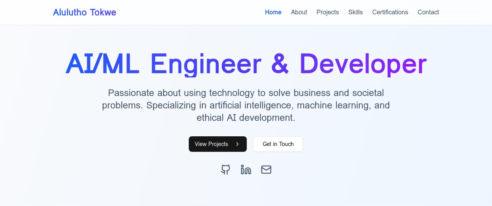

# Alulutho Tokwe - Professional Portfolio Website

A responsive, modern portfolio website showcasing my AI/ML projects, skills, and professional background.

## 🌟 Live Demo

Visit the live website: [Alulutho Tokwe Portfolio](https://alulutho-tokwe.vercel.app/)



## 🚀 Features

- **Responsive Design:** Fully responsive layout that works seamlessly on all devices
- **Modern UI:** Professional design with smooth animations and interactive elements
- **Project Showcases:** Detailed information about featured AI/ML projects
- **Skills Section:** Visual representation of technical skills and competencies
- **Certifications:** Display of specialized AI/ML training and certifications
- **Contact Information:** Easy access to professional contact details

## 💻 Technologies Used

- **React:** Frontend library for building the user interface
- **Vite:** Next-generation frontend tooling for faster development
- **Framer Motion:** Animation library for smooth transitions and effects
- **Tailwind CSS:** Utility-first CSS framework for styling
- **React Icons:** Icon library for visual elements
- **React Scroll:** Smooth scrolling between sections

## 📋 Project Structure

```
alulutho-portfolio/
├── public/              # Public assets
├── src/                 # Source files
│   ├── components/      # React components
│   ├── assets/          # Images and other assets
│   ├── App.jsx          # Main application component
│   ├── App.css          # Global styles
│   └── main.jsx         # Entry point
├── index.html           # HTML template
├── package.json         # Dependencies and scripts
└── vite.config.js       # Vite configuration
```

## 🛠️ Setup and Installation

1. **Clone the repository:**
   ```bash
   git clone https://github.com/Lutho123-Pe/My-portfolio-website.git
   cd My-portfolio-website
   ```

2. **Install dependencies:**
   ```bash
   npm install
   ```

3. **Run the development server:**
   ```bash
   npm run dev
   ```

4. **Build for production:**
   ```bash
   npm run build
   ```

## 🔄 Deployment

This portfolio is deployed on Vercel. To deploy your own version:

1. Fork this repository
2. Connect your GitHub account to Vercel
3. Import the repository in Vercel
4. Deploy!

## 📱 Contact Information

- **Email:** tokwealulutho@gmail.com
- **LinkedIn:** [linkedin.com/in/lutho-alulutho-84a122295](https://linkedin.com/in/lutho-alulutho-84a122295)
- **GitHub:** [github.com/Lutho123-Pe](https://github.com/Lutho123-Pe)

## 📄 License

This project is open source and available under the [MIT License](LICENSE).

---

Designed and developed by Alulutho Tokwe © 2025
